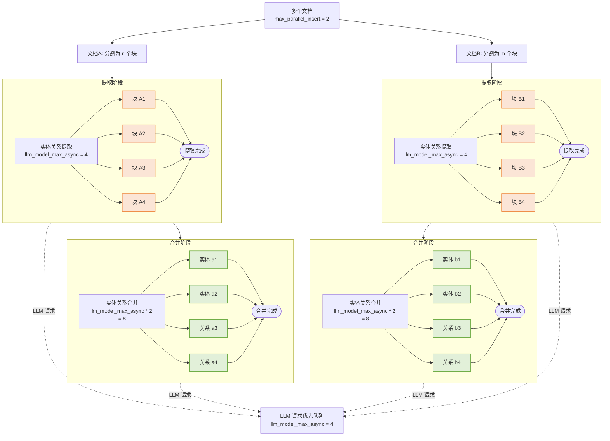

## LightRAG 多文档处理：并发控制策略

LightRAG 在处理多个文档时采用多层并发控制策略。本文深入分析文档级别、块级别和 LLM 请求级别的并发控制机制，帮助您理解特定并发行为发生的原因。

### 1. 文档级并发控制

**控制参数**: `max_parallel_insert`

此参数控制同时处理的文档数量。其目的是防止过度并行化导致系统资源过载，从而延长单个文件的处理时间。文档级并发由 LightRAG 内的 `max_parallel_insert` 属性控制，默认值为 2，可通过 `MAX_PARALLEL_INSERT` 环境变量配置。建议将 `max_parallel_insert` 设置在 2 到 10 之间，通常为 `llm_model_max_async/3`。将此值设置过高会增加不同文档在合并阶段实体和关系之间命名冲突的可能性，从而降低整体效率。

### 2. 块级并发控制

**控制参数**: `llm_model_max_async`

此参数控制文档内提取阶段同时处理的块数量。其目的是防止大量并发请求独占 LLM 处理资源，从而阻碍多个文件的高效并行处理。块级并发控制由 LightRAG 内的 `llm_model_max_async` 属性控制，默认值为 4，可通过 `MAX_ASYNC` 环境变量配置。此参数的目的是在处理单个文档时充分利用 LLM 的并发能力。

在 `extract_entities` 函数中，**每个文档独立创建**自己的块信号量。由于每个文档独立创建块信号量，系统的理论块并发数为：
$$
ChunkConcurrency = Max Parallel Insert × LLM Model Max Async
$$
例如：
- `max_parallel_insert = 2`（同时处理 2 个文档）
- `llm_model_max_async = 4`（每个文档最多 4 个块并发）
- 理论块级并发数：2 × 4 = 8

### 3. 图级并发控制

**控制参数**: `llm_model_max_async * 2`

此参数控制文档内合并阶段同时处理的实体和关系数量。其目的是防止大量并发请求独占 LLM 处理资源，从而阻碍多个文件的高效并行处理。图级并发由 LightRAG 内的 `llm_model_max_async` 属性控制，默认值为 4，可通过 `MAX_ASYNC` 环境变量配置。图级并行控制参数同样适用于文档删除后实体关系重建阶段的并行管理。

鉴于实体关系合并阶段不需要每次操作都与 LLM 交互，其并行度设置为 LLM 并发度的两倍。这既优化了机器利用率，又同时防止了对 LLM 的过度排队资源竞争。

### 4. LLM 级并发控制

**控制参数**: `llm_model_max_async`

此参数控制整个 LightRAG 系统分发的 LLM 请求的**并发量**，包括文档提取阶段、合并阶段和用户查询处理。

LLM 请求优先级通过全局优先队列管理，**系统优先处理用户查询**，其次是合并相关请求，最后是提取相关请求。这种策略性优先级**最小化了用户查询延迟**。

LLM 级并发由 LightRAG 内的 `llm_model_max_async` 属性控制，默认值为 4，可通过 `MAX_ASYNC` 环境变量配置。

### 5. 完整并发层级图

> 提取和合并阶段共享一个全局优先级 LLM 队列，由 `llm_model_max_async` 控制。虽然可能有大量实体和关系提取及合并操作正在"主动处理"，但**只有有限的数量会同时执行 LLM 请求**，其余的操作将排队等待。

### 6. 性能优化建议

* **根据您的 LLM 服务器或 API 提供商的能力增加 LLM 并发设置**

在文件处理阶段，LLM 的性能和并发能力是关键瓶颈。在本地部署 LLM 时，服务的并发能力必须充分考虑 LightRAG 的上下文长度要求。LightRAG 建议 LLM 支持最小 32KB 的上下文长度；因此，服务器并发应基于此基准计算。对于 API 提供商，如果由于并发请求限制导致客户端请求被拒绝，LightRAG 将重试请求最多三次。可以使用后端日志确定是否发生 LLM 重试，从而指示 `MAX_ASYNC` 是否超过了 API 提供商的限制。

* **使并行文档插入设置与 LLM 并发配置保持一致**

建议的并行文档处理任务数量为 LLM 并发度的 1/4，最小为 2，最大为 10。设置较高的并行文档处理任务数量通常不会加速整体文档处理速度，因为即使少量并发处理的文档也能充分利用 LLM 的并行处理能力。过度的并行文档处理会显著增加每个文档的处理时间。由于 LightRAG 逐文件提交处理结果，大量并发文件需要缓存大量数据。如果发生系统错误，所有中间阶段的文档都需要重新处理，从而增加错误处理成本。例如，当 `MAX_ASYNC` 配置为 12 时，将 `MAX_PARALLEL_INSERT` 设置为 3 是合适的。
